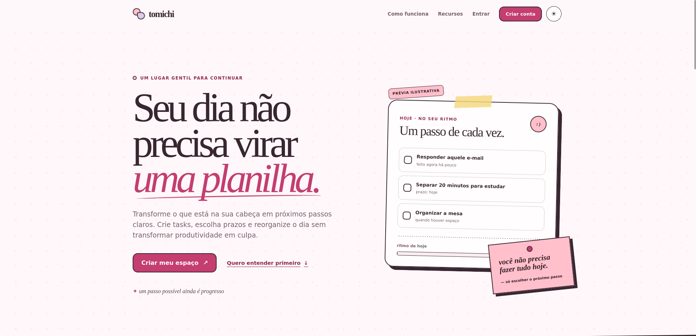
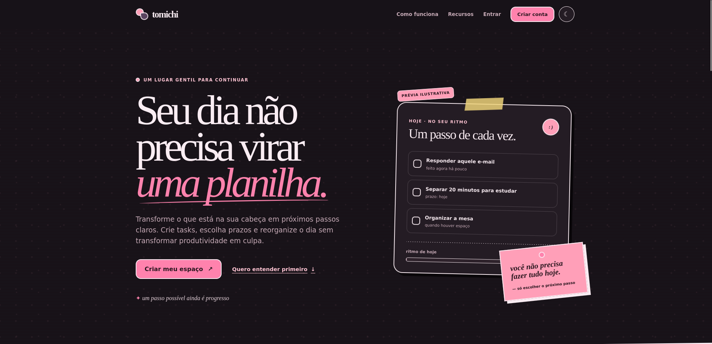
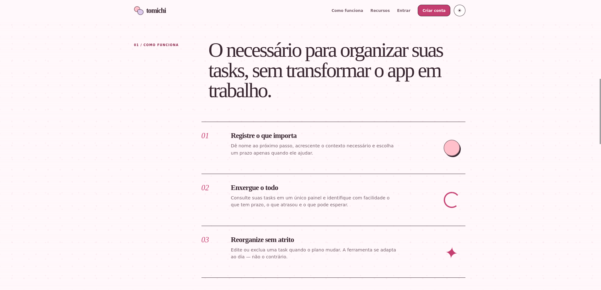

# Tomichi

> Um lugar gentil para transformar o que está na sua cabeça em próximos passos
> claros.

Tomichi é uma aplicação web de organização pessoal focada em uma experiência
simples e acolhedora. O projeto combina uma API construída com **FastAPI**,
persistência com **SQLAlchemy** e um frontend server-side com **Jinja2, CSS e
JavaScript nativo**.

O projeto está atualmente no estágio de **MVP em desenvolvimento**. Registro,
login, listagem e criação de tasks já possuem uma implementação inicial. A
autenticação por sessão, o isolamento seguro dos dados e as operações de edição
e exclusão fazem parte das próximas entregas antes da publicação.

## Interface

### Página inicial — tema claro



### Página inicial — tema escuro



### Como funciona



## Funcionalidades

### Implementadas

- página inicial responsiva;
- criação de conta com validação dos dados;
- login com verificação de senha;
- armazenamento seguro de senhas com hash Argon2id;
- dashboard inicial do usuário;
- listagem das tasks de um usuário;
- criação de tasks com prazo opcional;
- filtros e estados visuais para a lista de tasks;
- temas claro e escuro com preferência persistida no navegador;
- interface acessível por teclado e adaptada para dispositivos móveis.

### Em desenvolvimento para o MVP 1.0

- sessão de usuário segura e revogável;
- identificação do usuário exclusivamente pela sessão;
- proteção das rotas e do dashboard;
- atualização e exclusão de tasks;
- encerramento de sessão;
- autorização por proprietário da task;
- testes automatizados de autenticação, autorização e CRUD;
- migrações do banco de dados;
- preparação do ambiente de produção.

## Tecnologias

| Área | Tecnologia |
|---|---|
| API | Python, FastAPI e Pydantic |
| Persistência | SQLAlchemy e SQLite no desenvolvimento |
| Segurança de senhas | `pwdlib` com Argon2id |
| Frontend | Jinja2, HTML, CSS e JavaScript nativo |
| Servidor ASGI | Uvicorn |

O frontend não utiliza framework JavaScript, gerenciador de pacotes ou etapa de
build. Essa decisão mantém o MVP pequeno e aproveita a renderização de templates
que já faz parte da aplicação FastAPI.

## Arquitetura

```text
tomichi/
├── frontend/
│   ├── static/
│   │   ├── css/
│   │   └── js/
│   └── templates/
├── media/
├── src/
│   ├── database/
│   ├── modules/
│   │   ├── auth/
│   │   ├── pages/
│   │   └── tasks/
│   └── security/
├── tests/
├── main.py
└── requirements.txt
```

- `src/modules/auth`: schemas, model e rotas de usuários e autenticação;
- `src/modules/tasks`: schemas, model e rotas de tasks;
- `src/modules/pages`: rotas responsáveis por renderizar as páginas;
- `src/database`: engine, sessão e configuração da persistência;
- `src/security`: criação e verificação dos hashes de senha;
- `frontend/templates`: páginas renderizadas pelo Jinja2;
- `frontend/static`: estilos e comportamento executado no navegador.

## Rotas

### Páginas

| Método | Rota | Descrição | Status |
|---|---|---|---|
| `GET` | `/` | Redireciona para a página inicial | Implementada |
| `GET` | `/homepage/` | Renderiza a página inicial | Implementada |
| `GET` | `/registrar` | Renderiza o formulário de cadastro | Implementada |
| `GET` | `/login` | Renderiza o formulário de login | Implementada |
| `GET` | `/logged/dashboard` | Renderiza o dashboard | Implementada, ainda sem proteção de sessão |

### Autenticação e usuários

Prefixo: `/api/v1/auth`

| Método | Rota | Descrição | Status |
|---|---|---|---|
| `POST` | `/api/v1/auth/registrar` | Cria uma conta | Implementada |
| `POST` | `/api/v1/auth/login` | Valida username e senha | Implementada, ainda sem criar sessão |
| `GET` | `/api/v1/auth/{user_id}` | Retorna o perfil público pelo ID | Temporária; será substituída pelo usuário da sessão |

### Tasks

| Método | Rota | Descrição | Status |
|---|---|---|---|
| `GET` | `/{user_id}/tasks` | Lista as tasks do usuário | Implementada, ainda sem autorização por sessão |
| `POST` | `/{user_id}/create_task` | Cria uma task para o usuário | Implementada, ainda sem autorização por sessão |
| `PATCH` | `/api/v1/tasks/{task_id}` | Atualiza uma task do usuário autenticado | Planejada |
| `DELETE` | `/api/v1/tasks/{task_id}` | Exclui uma task do usuário autenticado | Planejada |

Na versão final do contrato, o `user_id` não será aceito como fonte de identidade
enviada pelo navegador. O backend obterá o proprietário exclusivamente pela
sessão autenticada.

### Rota temporária de desenvolvimento

| Método | Rota | Descrição |
|---|---|---|
| `GET` | `/tests/getallusers` | Lista usuários para inspeção durante o desenvolvimento |

Essa rota expõe dados de usuários e **deve ser removida antes de qualquer
publicação**.

### Documentação automática

Com a aplicação em execução, o FastAPI disponibiliza:

- Swagger UI: `http://127.0.0.1:8000/docs`;
- ReDoc: `http://127.0.0.1:8000/redoc`;
- schema OpenAPI: `http://127.0.0.1:8000/openapi.json`.

## Contratos principais

### Criar uma conta

`POST /api/v1/auth/registrar`

```json
{
  "username": "joao.silva",
  "first_name": "João",
  "last_name": "Silva",
  "email": "joao.silva@example.com",
  "password": "uma-senha-segura"
}
```

### Fazer login

`POST /api/v1/auth/login`

```json
{
  "username": "joao.silva",
  "password": "uma-senha-segura"
}
```

No estado atual, o endpoint devolve o perfil público quando as credenciais são
válidas. A criação do cookie de sessão ainda será implementada.

### Criar uma task

`POST /{user_id}/create_task`

```json
{
  "title": "Finalizar documentação",
  "content": "Revisar as rotas e os passos de instalação do projeto.",
  "due_date": "2026-07-30T18:00:00Z"
}
```

`due_date` é opcional e pode ser enviado como `null`.

## Como executar localmente

### Pré-requisitos

- Python 3.12 ou superior;
- Git;
- suporte à criação de ambientes virtuais com `venv`.

### 1. Clone o repositório

Na página do projeto no GitHub, abra o menu **Code** e clone o repositório pela
URL HTTPS ou faça o download em formato ZIP. Em seguida, acesse a pasta do
projeto:

```bash
cd Tomichi
```

### 2. Crie e ative o ambiente virtual

```bash
python3 -m venv .venv
source .venv/bin/activate
```

No Windows PowerShell, a ativação é feita com:

```powershell
.\.venv\Scripts\Activate.ps1
```

### 3. Instale as dependências

```bash
python -m pip install -r requirements.txt
```

### 4. Configure o banco de dados

Crie um arquivo `.env` na raiz do projeto:

```env
DATABASE_URL=sqlite:///./src/database/dev.db
```

O `.env` e os arquivos `*.db` são ignorados pelo Git. Não versione credenciais,
segredos ou bancos locais.

### 5. Inicie a aplicação

```bash
uvicorn main:app --reload
```

Acesse `http://127.0.0.1:8000`. A opção `--reload` é apropriada apenas para o
ambiente de desenvolvimento.

## Validações atuais

| Campo | Regras |
|---|---|
| `username` | entre 3 e 50 caracteres |
| `first_name` | entre 3 e 30 caracteres |
| `last_name` | entre 3 e 50 caracteres |
| `email` | e-mail válido, com até 50 caracteres |
| `password` | entre 3 e 50 caracteres no contrato atual |
| título da task | entre 2 e 100 caracteres |
| conteúdo da task | entre 5 e 500 caracteres |
| prazo da task | data e hora opcionais |

As regras de senha ainda serão endurecidas antes da publicação. O roadmap do
MVP prevê senhas entre 15 e 128 caracteres e suporte a passphrases.

## Segurança

### O que já existe

- senhas armazenadas como hash Argon2id;
- senha e hash não são retornados pelos schemas da API;
- checagem de duplicidade de username e e-mail;
- conteúdo fornecido pelo usuário inserido no frontend com `textContent`;
- mensagens de login sem revelar a senha ou seu hash;
- `.env` e bancos locais excluídos do versionamento.

### Limitações conhecidas

- o login ainda não cria uma sessão autenticada;
- o dashboard ainda pode ser acessado sem autenticação;
- as rotas de tasks confiam no `user_id` recebido na URL;
- ainda não há verificação de propriedade para cada operação;
- atualização, exclusão e logout ainda não existem;
- não há proteção contra abuso ou limitação de requisições;
- os testes automatizados de segurança ainda serão implementados;
- a rota `/tests/getallusers` precisa ser removida.

> **Importante:** o estado atual é adequado para desenvolvimento local e
> demonstração controlada. Ainda não deve ser publicado como aplicação
> multiusuário.

## Roadmap resumido

1. congelar os contratos da V1 e preservar o frontend atual;
2. implementar sessão server-side segura;
3. proteger requisições, arquivos estáticos e rotas privadas;
4. concluir a API autenticada de tasks;
5. integrar a autenticação ao frontend;
6. conectar o CRUD completo ao dashboard;
7. criar testes com dois usuários e um visitante anônimo;
8. executar QA, documentação e os gates de release;
9. preparar migrações, infraestrutura e controles para publicação.

Recuperação de senha, MFA, anexos, notificações, prioridades, conclusão de tasks
e painel administrativo estão fora do escopo do MVP 1.0.

## Licença

Este projeto é distribuído sob os termos definidos no arquivo [LICENSE](LICENSE).
